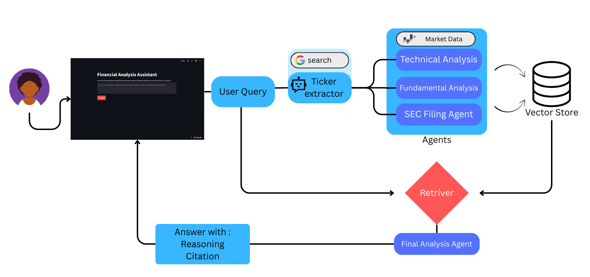

# 📊 Financial Analysis Assistant

An AI-powered financial analysis application that combines **technical indicators**, **fundamental financial statements**, and **SEC filings** to deliver deep, evidence-based insights on NASDAQ-listed companies.  
Built with **Streamlit**, **Groq LLM**, **yFinance**, and **FAISS** for interactive, context-aware financial research.

---

## 🖼 Workflow



---

## 🚀 Features

- **💡 Natural Language Queries**  
  Ask complex questions about stock performance, fundamentals, or trends in plain English.

- **📈 Technical Analysis**  
  Calculates 40+ technical indicators (RSI, MACD, EMA, ADX, OBV, ATR, Aroon, Stochastic, etc.) with automatic support/resistance detection.

- **📊 Fundamental Analysis**  
  Generates professional, multi-section reports on cash flow, profitability, balance sheet health, and future outlook.

- **📜 SEC Filing Parsing**  
  Downloads and extracts relevant sections from 10-K filings via SEC APIs.

- **🔍 Vector Search**  
  Stores financial, technical, and filing data in a FAISS vector database for semantic retrieval.

- **🧠 AI-Powered Insights**  
  Uses Groq's `llama3-70b-8192` model to synthesize responses with citations, reasoning, and confidence levels.

---

## 🛠️ Tech Stack

- **Frontend**: [Streamlit](https://streamlit.io)  
- **LLM Backend**: [Groq API](https://groq.com)  
- **Financial Data**: [yFinance](https://pypi.org/project/yfinance), [edgartools](https://pypi.org/project/edgartools/)  
- **SEC Data**: [sec_downloader](https://pypi.org/project/sec-downloader/), [sec_parser](https://pypi.org/project/sec-parser/)  
- **Vector Database**: [FAISS](https://github.com/facebookresearch/faiss)  
- **Indicators**: [ta](https://technical-analysis-library-in-python.readthedocs.io/)  

---

## 📂 Project Structure

```
.
├── app.py                 # Streamlit UI
├── main.py                # Vector DB processing & query pipeline
├── utils.py               # Query processing, ticker extraction, final orchestration
├── agents/
│   ├── fundamental.py     # Groq-based financial statement analysis
│   ├── tech.py            # Technical indicator computation & LLM synthesis
│   ├── sec.py             # SEC filing download & parsing
├── Agent_Workflow_.png    # Workflow diagram
├── requirements.txt       # Dependencies
```

---

## ⚙️ Installation

```bash
git clone https://github.com/<your-username>/<your-repo>.git
cd <your-repo>
pip install -r requirements.txt
```

---

## 🔑 API Keys Required

You will need:

- **Groq API Key** → [Get here](https://console.groq.com)
- **SerpAPI Key** → [Get here](https://serpapi.com)

These can be entered directly in the Streamlit sidebar.

---

## ▶️ Usage

Run the Streamlit app:

```bash
streamlit run app.py
```

1. Enter your **Groq API Key** and **SerpAPI Key** in the sidebar.
2. Type your financial query (e.g., _"Do a momentum analysis of Amazon for the past 2 weeks. Has it broken the past high?"_).
3. Click **Analyze** to get:
   - 📌 Direct Answer  
   - 📊 Reasoning  
   - 📚 Citations  
   - 🎯 Confidence Level  
